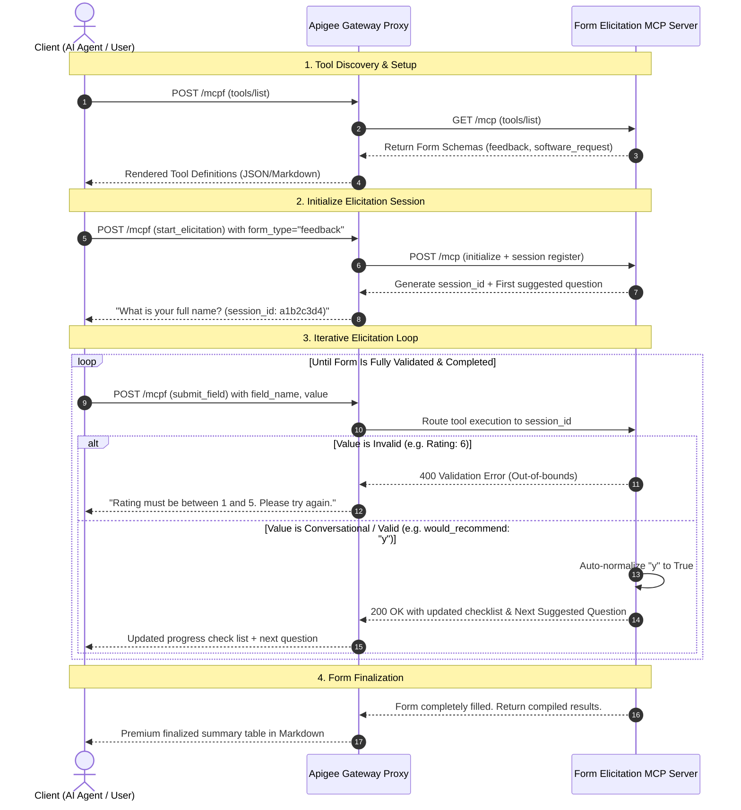

# Form Elicitation MCP Server (FastMCP)

An interactive, session-based Form Elicitation Model Context Protocol (MCP) server built with Python's high-level `FastMCP` framework and `Pydantic V2`. 

This server allows AI agents and client hosts to dynamically guide users through structured form-filling processes (such as user onboarding, feature requests, or feedback collection) step-by-step, complete with real-time input validation, data coercion/normalization, progress tracking, and formatted markdown outputs.

---

## Features

* **Multi-Form Support**: Built-in schemas for `software_request` and `feedback` forms.
* **Granular Validation**: Fields are validated dynamically on-the-fly using standard Pydantic V2 models.
* **Smart Normalization**: Input strings are automatically parsed and coerced to their corresponding native Python types (e.g., `"yes"`/`"true"` -> `True` for booleans; ISO-format strings -> `date` objects; `"fastapi"` -> `"FastAPI"` matching permitted literals).
* **Session-Based State**: Manage multiple parallel elicitation sessions simultaneously in-memory.
* **Guiding Output**: The server tracks what fields are missing and explicitly highlights a **Next Suggested Question** to guide the client's conversational flow.
* **Beautiful Markdown Presentations**: Elicitation progress is rendered in structured, aesthetic markdown tables for premium readability in AI interfaces.

---

## Project Layout

```
elicitation_sample/
├── .venv/                # Local virtual environment
├── server.py             # The FastMCP server implementation
├── client.py             # Local automated and interactive test client
├── requirements.txt      # Dependency file
└── README.md             # Setup and usage guide
```

## Elicitation Interaction Flow

The sequence below outlines how a client interacts with the gateway proxy to dynamically elicit and normalize structured forms:



## Apigee Gateway Architecture: Parallel Fan-Out Engine

To provide unified tool discovery, session initialization, and event polling across a distributed microservice landscape, the Apigee Gateway leverages an **optimized parallel fan-out engine** built inside a custom Java Callout (`ServiceFanout.java`).

```mermaid
graph LR
    Client[Client / Agent] ==>|Single Request| Gateway[Apigee Gateway Proxy]
    subgraph Java Callout Engine (ServiceFanout)
        Gateway -->|Concurrent sendAsync| ThreadPool[Fixed Thread Pool]
        ThreadPool --> Target1(mcp-server-1: Weather)
        ThreadPool --> Target2(mcp-server-2: Products)
        ThreadPool --> Target3(mcp-server-3: Cart)
        ThreadPool --> Target4(elicitation-server: Forms)
    end
    Target1 & Target2 & Target3 & Target4 ===>|Parallel Stream Read| Buffer[Thread-safe Aggregator]
    Buffer ==>|Aggregated Payload| Client
```

### Core Features of the Fan-Out Engine:

1. **Concurrent HTTP/2 Connections:**
   Using Java's native HTTP Client, connections to all 5 target microservices are initialized and established simultaneously (`httpClient.sendAsync()`), bypassing sequential TCP connection bottlenecks.

2. **Concurrent Stream Reading:**
   Response bodies (such as Server-Sent Events or heavy JSON payloads) are read inside a dedicated background daemon thread pool. This prevents thread leakage inside the Apigee container on redeployment.

3. **Unified Timeout Enforcement:**
   When reading streaming data (such as polling idle endpoints that keep connections open with empty keep-alive pings), a strict, unified timeout guard is enforced concurrently across all threads:
   ```java
   CompletableFuture.allOf(bodyReadFutures)
       .get(timeoutSeconds, TimeUnit.SECONDS);
   ```
   If any target blocks for longer than the allowed threshold (e.g., `2` seconds), its background socket and input stream are instantly closed to unblock resources. Crucially, **timeouts do not accumulate sequentially**, ensuring the gateway response remains fast and bounded regardless of the number of targets fanned out to.

---

## Prerequisites & Setup

Make sure you have Python 3.10+ installed.

### 1. Clone & Navigate
Ensure you are inside the project directory:
```bash
cd /Users/gonzalezruben/Documents/elicitation_sample
```

### 2. Initialize Virtual Environment
```bash
python3 -m venv .venv
source .venv/bin/activate
```

### 3. Install Dependencies
Install the required packages from the PyPI repository:
```bash
pip install -r requirements.txt --index-url https://pypi.org/simple
```

---

## Running Local Verification

You can verify the server's capabilities, dynamic validations, and state management using the built-in test client (`client.py`).

### Run Automated Validation Suite
Ensure your virtual environment is activated and run:
```bash
python3 client.py
```
This tests standard schemas, validation bounds (e.g., invalid framework string `'Cobol'`, invalid email address), type normalization, and step-by-step progress tracking.

### Run Interactive CLI Wizard
To fill out a form interactively in the console with real-time validation, run:
```bash
python3 client.py --interactive
```

---

## MCP Tool Specifications

The server exposes the following MCP tools to its host client:

### 1. `list_form_types`
* **Description**: Retrieves supported form types and their schemas.
* **Parameters**: None
* **Return**: A rich Markdown table explaining the required field names, types, and descriptions.

### 2. `start_elicitation`
* **Description**: Starts a new form-filling session.
* **Parameters**:
  * `form_type` (string, required): The type of form to load. Currently supported: `software_request` or `feedback`.
* **Return**: A unique 8-character `session_id` and the initial progress status in markdown.

### 3. `submit_field`
* **Description**: Submits a value for a specific form field in an active session.
* **Parameters**:
  * `session_id` (string, required): The active session identifier.
  * `field_name` (string, required): The field name to submit.
  * `field_value` (string, required): The value to validate and save.
* **Return**: The updated session progress, a checklist of completed vs. missing fields, and the **Next Suggested Question**. If all fields are successfully entered, it returns a finalized compiled form summary.

### 4. `get_elicitation_status`
* **Description**: Retrieves current progress and entries for an active session.
* **Parameters**:
  * `session_id` (string, required): The active session identifier.
* **Return**: An aesthetic Markdown summary of the session state.

### 5. `reset_elicitation`
* **Description**: Resets an active session, clearing all previously filled values.
* **Parameters**:
  * `session_id` (string, required): The active session identifier.
* **Return**: Status message confirming the session has been reset.

## Feedback Elicitation Guide

The Feedback Form is designed to collect customer satisfaction reviews, ratings, and comments. The elicitation flow parses inputs dynamically, applying validation and type coercion (such as mapping conversational words into boolean constants).

### 1. Schema Requirements & Rules

The `feedback` form collects and validates the following inputs:

| Field Name | Type | Validation Bounds | Normalization / Coercion Rules |
| :--- | :--- | :--- | :--- |
| `customer_name` | String | Minimum 2 characters | Whitespace is automatically trimmed. |
| `rating` | Integer | Range: `1` (poor) to `5` (excellent) | Numeric strings are automatically coerced to integers. |
| `comments` | String | Minimum 5 characters | Whitespace is automatically trimmed. |
| `would_recommend` | Boolean | Strict `True` or `False` | **Conversational Normalization:** Words like `"yes"`, `"y"`, `"true"`, `"1"` resolve to `True`. `"no"`, `"n"`, `"false"`, `"0"` resolve to `False`. |

---

### 2. Walkthrough: Step-by-Step Interactive Session

Here is an example sequence of how a client or AI agent guides the user through the feedback form:

#### Step A: Start the session
Start a new feedback session:
```json
{
  "name": "start_elicitation",
  "arguments": {
    "form_type": "feedback"
  }
}
```
*Response returns a unique `session_id` (e.g., `a1b2c3d4`) and highlights the **Next Suggested Question**: "What is your full name?"*

#### Step B: Submit customer name
```json
{
  "name": "submit_field",
  "arguments": {
    "session_id": "a1b2c3d4",
    "field_name": "customer_name",
    "field_value": "Jane Doe"
  }
}
```
*The checklist updates to show `customer_name` is complete. The next suggested question changes to: "How would you rate your experience from 1 to 5?"*

#### Step C: Submit an invalid rating (Validation check)
If the user replies with an out-of-bounds rating, the system gracefully rejects it:
```json
{
  "name": "submit_field",
  "arguments": {
    "session_id": "a1b2c3d4",
    "field_name": "rating",
    "field_value": "6"
  }
}
```
*Response returns a validation error: "Rating must be between 1 and 5." The session state is preserved.*

#### Step D: Submit rating and comments
Submit a valid rating:
```json
{
  "name": "submit_field",
  "arguments": {
    "session_id": "a1b2c3d4",
    "field_name": "rating",
    "field_value": "5"
  }
}
```
And submit comments:
```json
{
  "name": "submit_field",
  "arguments": {
    "session_id": "a1b2c3d4",
    "field_name": "comments",
    "field_value": "Great tool!"
  }
}
```

#### Step E: Submit recommendation with Conversational Normalization
Submit a conversational `"y"` response:
```json
{
  "name": "submit_field",
  "arguments": {
    "session_id": "a1b2c3d4",
    "field_name": "would_recommend",
    "field_value": "y"
  }
}
```
*The backend normalizes `"y"` to `True` (Yes). Since all fields are complete, the final payload returns a beautiful completed summary table in Markdown.*

---

## Registering with an MCP Host (e.g., Claude Desktop)

To integrate this Form Elicitation tool suite into Claude Desktop or other MCP-enabled clients, add the following configuration block to your host's settings file (e.g., `~/Library/Application Support/Claude/claude_desktop_config.json` on macOS):

```json
{
  "mcpServers": {
    "form-elicitor": {
      "command": "/Users/gonzalezruben/Documents/elicitation_sample/.venv/bin/python3",
      "args": [
        "/Users/gonzalezruben/Documents/elicitation_sample/server.py"
      ]
    }
  }
}
```

Restart Claude Desktop, and you'll see the tools under the "Available Tools" pane, ready to elicit structured forms in natural conversation!
